# 
General Tso's Chicken

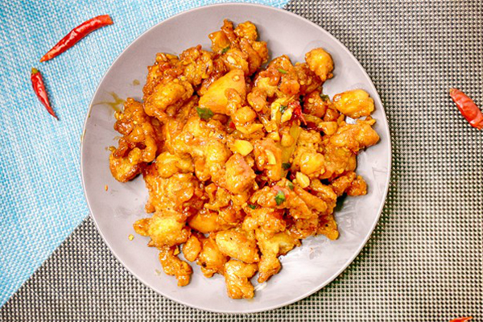

### 1. Description of the Recipe
[General Tso's chicken](https://en.wikipedia.org/wiki/General_Tso%27s_chicken#Recipes) ([tswò]; Chinese: 左宗棠雞; pinyin: Zuǒ Zōngtáng jī) is a sweet and spicy deep-fried chicken dish that is served in North American Chinese restaurants. The dish is named after Zuo Zongtang, formerly romanized "Tso Tsung-t'ang", a Qing dynasty statesman and military leader, although the dish has no recorded connection to Zuo nor is the dish known in Zuo's home province, Hunan.  
&nbsp;

### 2. The list of ingredients
| ingredients | Quantity |
| ----------- | ----------- |
| Chicken | 1 Pound |
| Corn Starch | 375 ml |
| Salt | 2.5 ml |
| Black Pepper | 2.5 ml |
| Oil | 750 ml |
| Dry Red Pepper | 8 |
| Soy Source | 15 ml |
| Rice Wine | 15 ml |
| Egg White | 2 |
| Grlic | 2 |
| Chicken Soup | 60 ml |
| Ketchup | 22.5 ml |
| Rice Vinegar | 15 ml |
| Seafood Sauce | 5 ml |
| Chili Sauce | 5 ml|
| Sesame Oil | 5 ml |
| Sugar | 15 ml |

&nbsp;

### 3. Step by Step Instructions

<em>Method One: Chicken Massage</em>

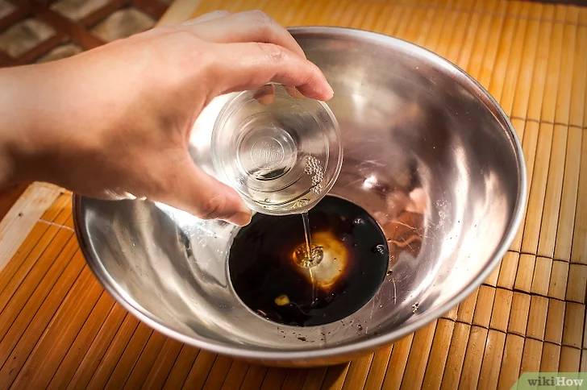  

<strong> 1. Mix the marinade</strong>
- In a large bowl combine soy sauce, rice wine, and egg whites.

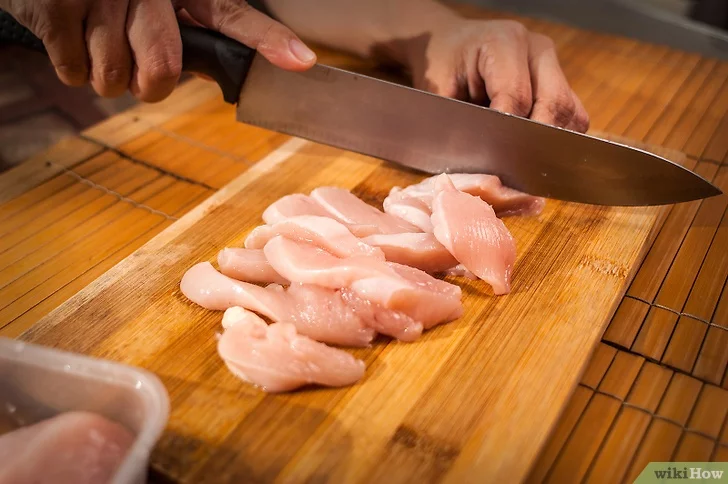  

<strong>2. Cut the chicken into small pieces</strong>
- Each piece should be about 1 inch (2.5 cm) in width and length. 
- It should be thawed before preparing. But in fact, frozen chicken is better to cut.

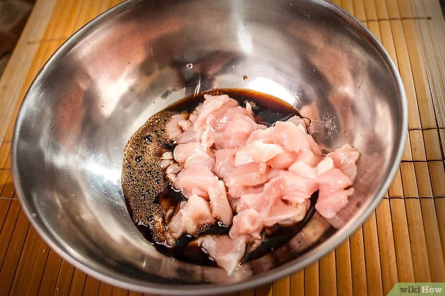  

<strong>3. Let the chicken marinate in the marinade</strong>
- Marinate the chicken pieces in a bowl and toss with a fork or spoon to evenly coat the chicken pieces with the marinade. 
- Let the chicken marinate for 10-30 minutes. Cover with plastic wrap

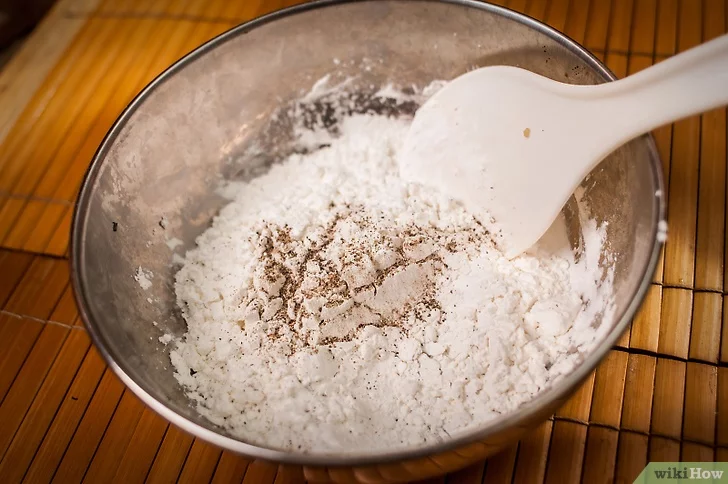  

<strong>4. Cut the chicken into small pieces</strong>
- Each piece should be about 1 inch (2.5 cm) in width and length. It should be thawed before preparing. 
- But in fact, frozen chicken is better to cut.

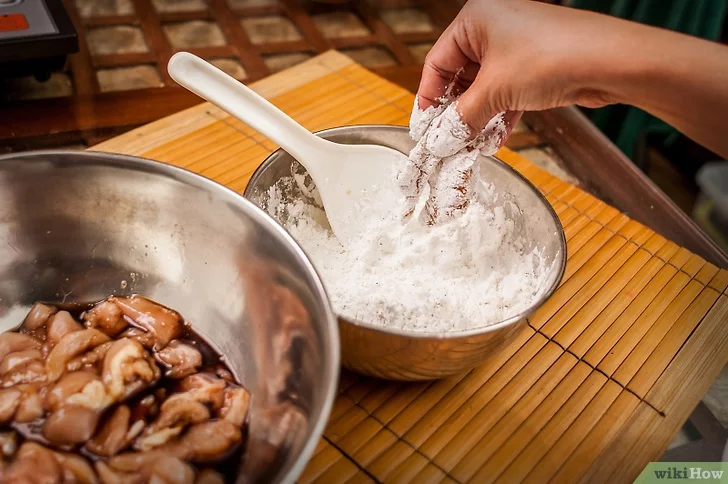  

<strong>5. “Paint” the chicken</strong>
- Let the chicken hang over the bowl for a few seconds before taking out to allow excess flour to drip off.
- When done, give it a shake to remove excess flour.

&nbsp;

<em>Method Two: Chicken Massage</em>

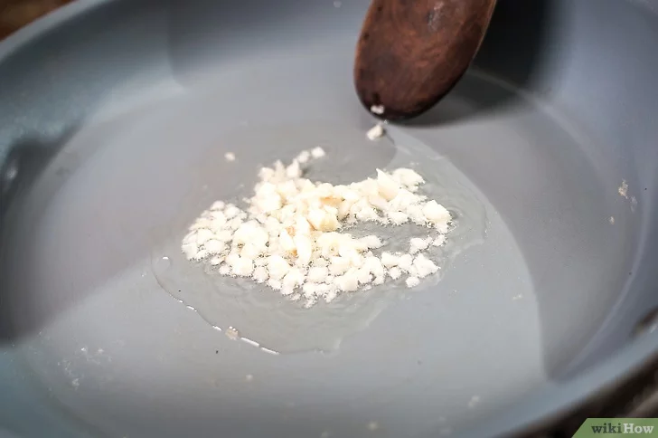  

<strong>1. Heat the garlic</strong>
- Heat 1 tablespoon (15 mL) oil in a large skillet over high heat. When the oil is hot, sauté minced garlic for 1 minute or until fragrant or browned..
- Stir the garlic constantly to prevent burning.
- Sprinkle a few drops of water into the pan to test the oil temperature. If the water sizzles when it comes into contact with the oil, the oil is hot enough.
- Use vegetable oil, canola oil, or peanut oil.

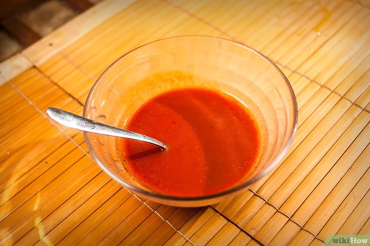  

<strong>2. Mix other ingredients</strong>
- In a medium bowl combine chicken stock, tomato paste, rice vinegar, hoisin sauce, chili sauce, sesame oil, sugar, and cornstarch.
- Make sure both the cornstarch and sugar are completely dissolved.
- If you don't have rice vinegar, you can use distilled white vinegar instead.
- If you don't have chicken stock, use broth or water.
- If you can't find chili paste, you can use 2 teaspoons (10 mL) chili.

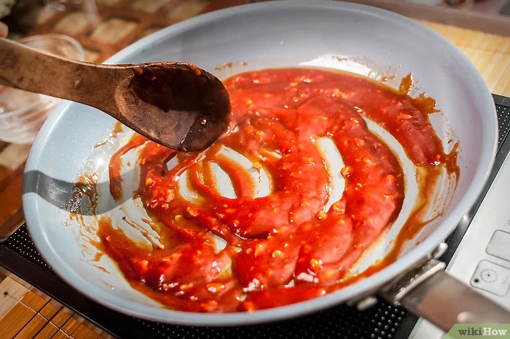  

<strong>3. Add liquid to the pot</strong>
- Slowly pour in the seasoned chicken broth and garlic. 
- Stir constantly until the sauce thickens.
- The soy sauce should be thick and shiny.
- After thickening, reduce heat and cover pot to maintain temperature.

&nbsp;

<em>Method Three: Fried the Chicken</em>

  

<strong>1. Heat frying oil</strong>  
- Heat 3 cups (750 ml) of oil for frying in a large pot.
- Use a candy thermometer to check the temperature of the oil. 
- It can be used when it reaches temperatures between 350 and 360 degrees Fahrenheit (177 to 182 degrees Celsius).
- Use vegetable oil, canola oil, peanut oil, or grapeseed oil.

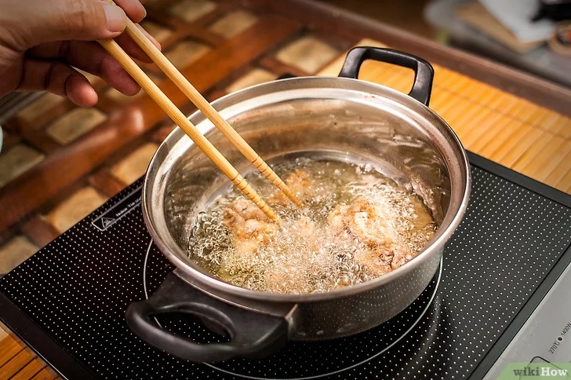  

<strong>2. Fried the chicken</strong>
- In batches of 2-4, fry the chicken until golden and crispy. 
- The inside of the chicken is also fried, and each piece needs to be fried for about 4 to 5 minutes.
- Before frying a batch of chicken, throw in a piece of chicken to test the oil temperature, then fry for 4 minutes. 
- If appropriate, add the rest of the chicken to the pot.

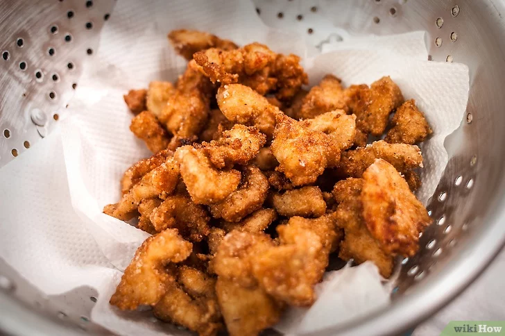  

<strong>3. Fried the chicken</strong>  
- As each piece of chicken is cooked through, remove it with a slotted spoon and drain on a clean paper towel.
- Use a slotted spoon to tap the edges or sides of the pan or deep fryer lightly as you move the chicken to keep the oil from splattering.

&nbsp;

<em>Method Four: Stir-Fry Sauce and Chicken </em>

  

<strong>1. Heat the oil again over medium-high heat</strong>
- If your pan is heavy, pour in 1 tablespoon (15 mL) of fresh oil and heat over medium-high heat.
- A deep fryer can also be used.
- Use this recipe for other types of oils as well.

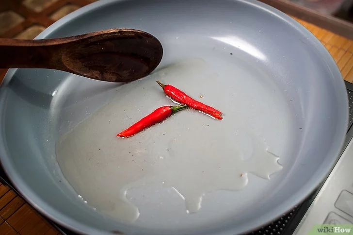  

<strong>2. Stir fry the peppers</strong>
- Add dried red chilies and stir-fry in oil. It only takes 20 to 30 seconds.
- If preferred, sauté the peppers before adding for a more even distribution.

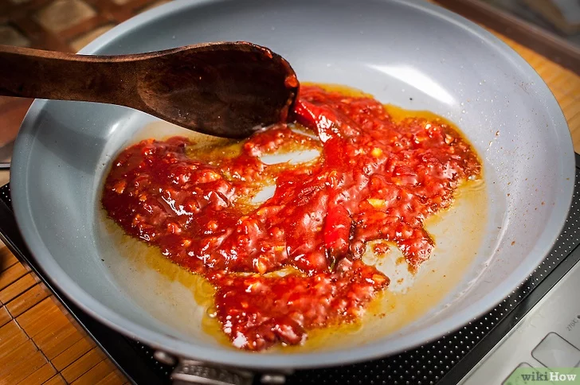  

<strong>3. Transfer the sauce to the pan</strong>
- Pour the sauce into the pot and cook for 1 minute, stirring, to combine with the peppers.
- Since the sauce is thick and stays warm, this step doesn't take too long. 
- Just heat until a few bubbles form.

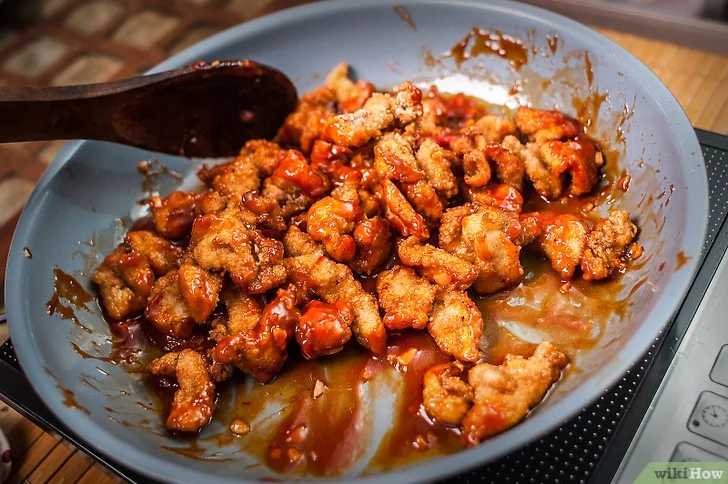  

<strong>4. Add Chicken</strong>
- Transfer the dry, drained chicken to the sauce, stirring to coat each piece evenly.
- The heating time is related to the time for the chicken to drain. You need to let the chicken cook in the sauce for a few minutes until reheated.

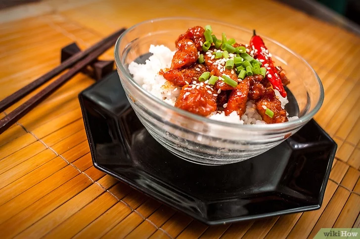  

<strong>5. Put toppings </strong>
- Pour the prepared chicken over the rice, and match it with sesame seeds and chopped green onions. 
- General Tso's chicken needs to be eaten while it is hot.
- Serve rice individually in bowls. Sprinkle sesame seeds and scallions liberally over the chicken.

### 4. credits
All images and content inside the step by step is from this [link](https://zh.wikihow.com/%E5%81%9A%E5%B7%A6%E5%AE%97%E6%A3%A0%E9%B8%A1)